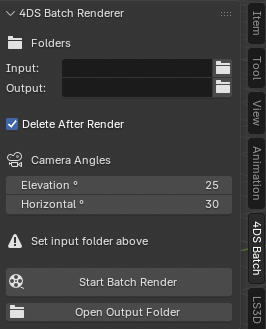
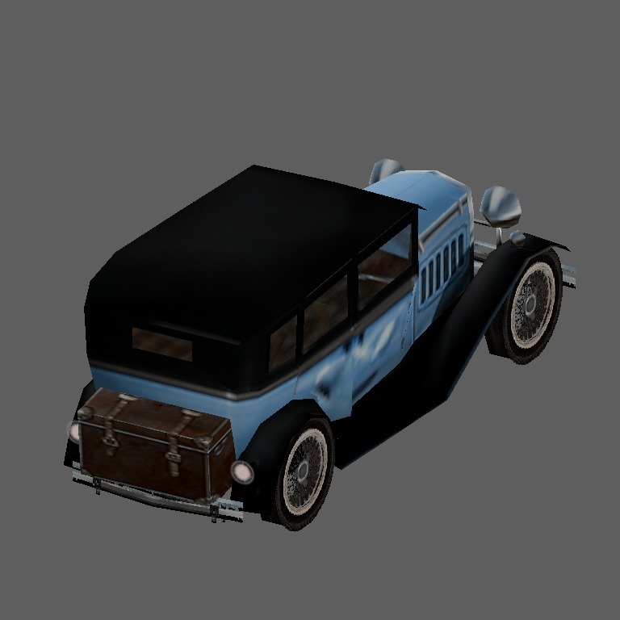
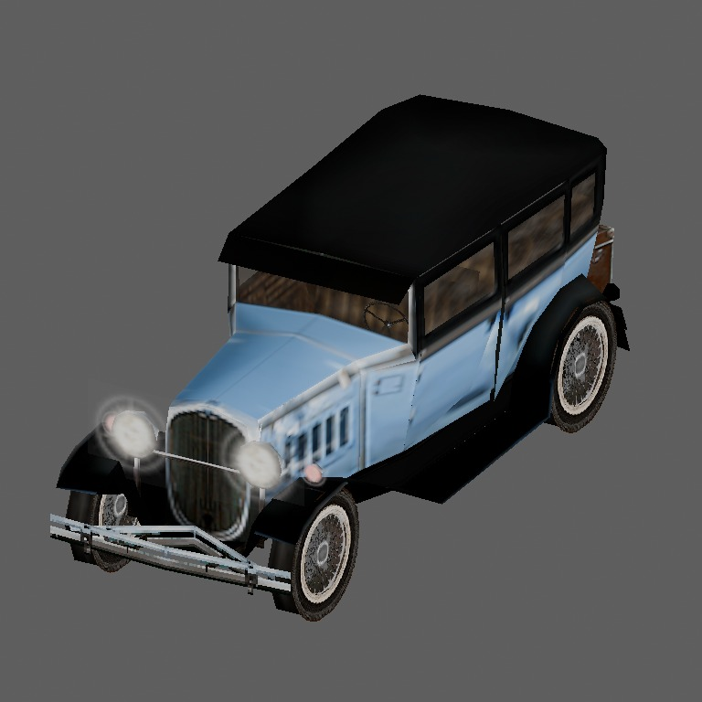

# Mafia Batch Renderer for Blender

Blender plugin for **batch rendering models from Mafia: The City of Lost Heaven**.

This addon allows automated importing and rendering of multiple Mafia models directly inside Blender.

### Blender Screenshot

## Why This Plugin Was Created

The plugin was originally created to help render and document models for the Mafia community project:

https://mafia-1989.cz/models/

### Back

## Requirements

This plugin **requires a 4DS import plugin** to open Mafia model files.

For correct functionality, you must use the `4ds.py` importer created by **Richard01_CZ**.

Download link:  
https://mafia-1989.cz/down-programy/

## Features

### Front

- Batch import of Mafia `.4ds` models
- Automated rendering workflow
- Supports rendering multiple models in sequence
- Blender integration

## Installation

1. Download the required `4ds.py` importer by Richard01_CZ.
2. Install the importer in Blender.
3. Install this addon.
4. Configure paths/settings if required.
5. Start batch rendering.

## Notes

Without the compatible `4ds.py` importer, the addon will not function correctly.

## Credits

- **4DS Importer:** Richard01_CZ  
